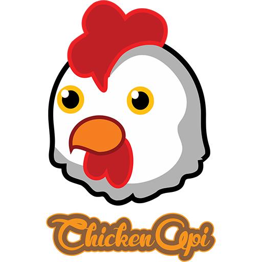

# ChickenAPI

</img>

 

## Description

ChickenAPI is an API, as Bukkit is for Minecraft, but for Nostale.
We do want to provide an interoperable API for developers that would like to create some custom content for Nostale Private Servers without having to install their own *piece of code* into the server source directly

## Documentation

PluginSystem
EventSystem
EntitySystem

## How to contribute

Pull requests are accepted however, we are still in a development phasis to make ChickenAPI production ready.

## Contributors

- BlowaXD
- Elendan
- Kraken
- SylEze
- DarkyZ

Special Thanks :
OpenNos contributors, that amount of work helped us to develop ChickenAPI with a lot of informations
